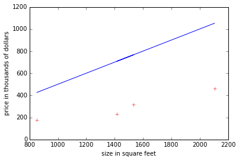

---
layout: page
title: Index
permalink: /
---

\begin{align}
\theta_0x_0+\theta_1x_1+\theta_2x_2+...+\theta_nx_n
\end{align}


```python
%matplotlib inline

import numpy as np
import matplotlib.pyplot as plt
 
M = np.matrix([[2104, 460],
                  [1416, 232],
                  [1534, 315],
                  [852, 178]])
 
x = np.asarray(M)[:, 0]
y = np.asarray(M)[:, 1]
 
plt.plot(x, y, 'r+')
plt.xlabel("size in square feet")
plt.ylabel("price in thousands of dollars")
 
# adding ones for our y-intercept parameter
x = np.asarray([np.ones(x.shape[0], dtype=np.int), x]).T
 
 # create theta params for x, each initialized as 0
theta = np.ones(x.shape[0], dtype=np.int) * 0.5
 
# linear regression hypothesis function
def hypo(theta, x):
    return (x.T * theta).T
 
plt.plot(np.asarray(x[:,1]).T, hypo(theta, x), 'b-');
 
plt.show()
```





```python

```
